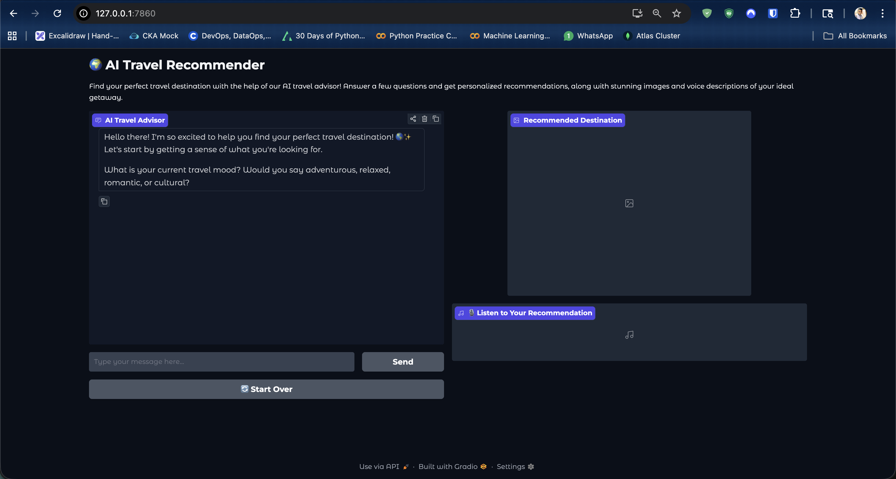
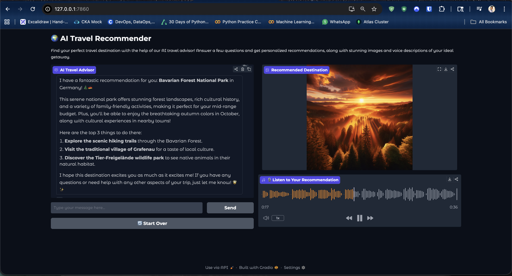

# AI Travel Recommender

<p align="center">
  <strong>An AI-powered travel advisor that recommends destinations through a conversational Gradio app, then brings the suggestion to life with an image and voice narration.</strong>
</p>

<p align="center">
  
  
  
  
  
</p>

## Overview

This project is a portfolio-style AI application that helps users discover a travel destination based on their mood, preferred landscape, travel month, travel companions, and budget.

Instead of returning only text, the app delivers a richer recommendation flow:

- A conversational AI travel advisor asks guided questions one at a time
- A destination recommendation is generated using an OpenAI tool call
- A cinematic destination image is created for the final recommendation
- A spoken audio summary is generated so the recommendation can be heard as well as read

## Why This Project Stands Out

- Combines chat, image generation, and text-to-speech in one experience
- Uses function calling to structure the final recommendation cleanly
- Presents the experience in a simple, user-friendly Gradio interface
- Demonstrates practical full-flow AI product thinking, not just a single API call

## Screenshots

### App Start State



### Recommendation Output



## Features

- Guided travel discovery conversation
- Personalized destination recommendation
- AI-generated destination image
- AI-generated voice narration
- Clean split-screen Gradio layout for chat, image, and audio
- Reset flow to start a new trip recommendation

## Tech Stack

- Python
- Gradio
- OpenAI API
- `gpt-4o-mini` for conversational recommendation logic
- `dall-e-3` for destination imagery
- `gpt-4o-mini-tts` for audio narration
- `python-dotenv` for environment variable loading
- Pillow for image handling

## How It Works

1. The app greets the user and starts a travel discovery conversation.
2. The assistant asks a fixed sequence of travel preference questions.
3. Once enough context is collected, the model calls the `recommend_destination` tool.
4. The app uses the structured destination result to:
   - show a written recommendation
   - generate a cinematic destination image
   - generate an MP3 voice summary
5. The final result is displayed in the Gradio interface.

## Project Structure

```text
ai-vacation-recommender/
├── app.py
├── requirements.txt
├── .env.example
├── assets/
│   └── screenshots/
│       ├── app-empty-state.png
│       └── app-recommendation-state.png
└── README.md
```

## Local Setup

### 1. Clone the repository

```bash
git clone <your-repo-url>
cd ai-vacation-recommender
```

### 2. Create and activate a virtual environment

```bash
python -m venv .venv
source .venv/bin/activate
```

### 3. Install dependencies

```bash
pip install -r requirements.txt
```

### 4. Configure environment variables

Create a `.env` file based on `.env.example`:

```env
OPENAI_API_KEY=your_openai_api_key
```

### 5. Run the application

```bash
python app.py
```

Then open the local Gradio URL shown in the terminal, typically:

```text
http://127.0.0.1:7860
```

## Example Use Case

A user says they want a relaxed autumn trip with family on a mid-range budget and prefer forests or mountains. The app can recommend a destination, explain why it fits, show a generated scenic image, and play back a short narrated summary.

## What I Learned

- How to build a multi-modal AI experience with one lightweight Python app
- How to connect structured tool outputs to downstream image and audio generation
- How to turn an LLM workflow into a usable product interface with Gradio

## Future Improvements

- Save past recommendations
- Add streaming responses for a more dynamic chat experience
- Support multiple voice options
- Add destination cards with weather, budget, and itinerary ideas
- Deploy the app for public access

## Environment Variables

| Variable | Description |
| --- | --- |
| `OPENAI_API_KEY` | API key used for chat, image generation, and text-to-speech |

## Author

Built as an AI portfolio project to showcase practical product thinking with OpenAI APIs, Python, and Gradio.
